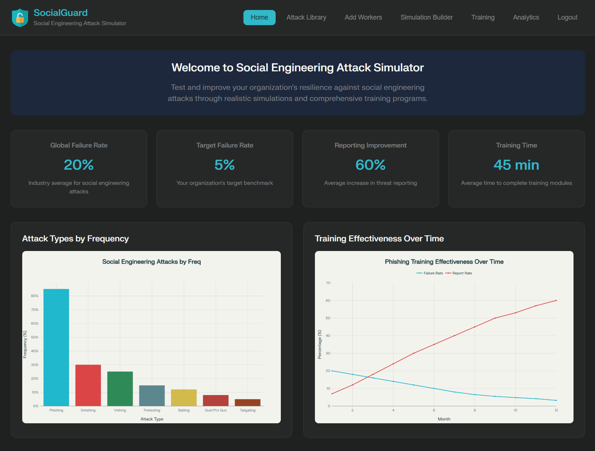
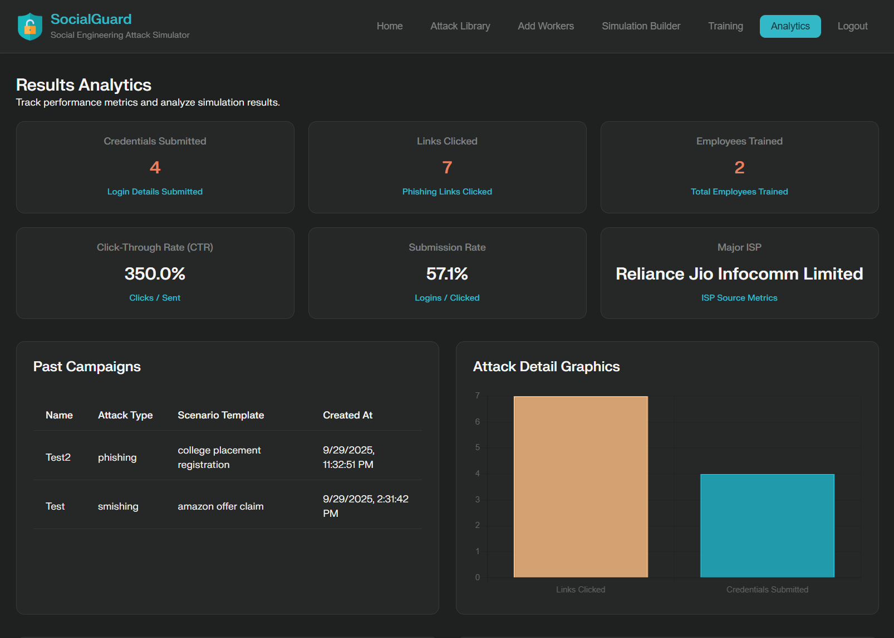

# SocialGuard - Social Engineering Attack Simulator

&nbsp;

## 🚀 Deployment

[](https://social-guard-rouge.vercel.app/)

[](https://social-guard-rouge.vercel.app/)

## 🖼️ Prototype Screenshots

<table>
  <tr>
    <td align="center">
      
      <br/>
      <b>Homepage View</b>
    </td>
    <td align="center">
      
      <br/>
      <b>Analytics View</b>
    </td>
  </tr>
</table>

## ⚡ Overview

SocialGuard is a comprehensive platform designed to help organizations defend against social engineering attacks through simulation, training, and analytics. The platform enables you to create realistic attack scenarios, train employees, and measure effectiveness through detailed reporting. With pre-built phishing templates, advanced tracking capabilities, and educational modules, SocialGuard provides a complete solution for social engineering defense.

## ✨ Features

- 🎯 **Attack Library** - Pre-configured social engineering attack scenarios
- 👥 **Employee Management** - Add and manage employees for targeted simulations
- 🔧 **Simulation Builder** - Create attack scenarios tailored to your organization with customizable templates
- 📚 **Training Modules** - Educational resources to help employees identify and respond to attacks
- 📊 **Analytics Dashboard** - Track simulation results and  with detailed metrics

## 📋 Getting Started

### Prerequisites

- Node.js (v16 or higher)
- Python (v3.8 or higher)
- npm or yarn
- Supabase account
- SendGrid account (for email functionality)
- Twilio account (for SMS functionality)

### Frontend Installation

1. Clone the repository:
   ```bash
   git clone https://github.com/shubhamaher8/SocialGuard.git
   cd SocialGuard
   ```

2. Install frontend dependencies:
   ```bash
   cd Frontend
   npm install
   ```

3. Set up frontend environment variables:
   Create a `.env` file in the `Frontend` directory:
   ```
   PARCEL_VITE_SUPABASE_URL=your_supabase_url
   PARCEL_VITE_SUPABASE_ANON_KEY=your_supabase_anon_key
   ```

4. Start the frontend development server:
   ```bash
   npm run dev
   ```

5. Open your browser and navigate to `http://localhost:1234`

### Backend Installation

1. Install backend dependencies:
   ```bash
   cd ../Backend
   pip install -r requirements.txt
   ```

2. Set up backend environment variables:
   Create a `.env` file in the `Backend` directory:
   ```
   SUPABASE_URL=your_supabase_url
   SUPABASE_KEY=your_supabase_service_key
   SENDGRID_API_KEY=your_sendgrid_api_key
   TWILIO_ACCOUNT_SID=your_twilio_account_sid
   TWILIO_AUTH_TOKEN=your_twilio_auth_token
   TWILIO_PHONE_NUMBER=your_twilio_phone_number
   ```

3. Start the backend server:
   ```bash
   python -m api.app
   ```

### Deployment

The application is configured for deployment on Vercel and Render:

- Frontend: Deployed via Vercel's automatic build process using Parcel
- Backend: Deployed on render free instance

## 📊 Project Structure

```
SocialGuard/
├── Backend/                 
│   ├─- api            
│   │   ├── static               #images
│   │   ├── templates            #attack pages
│   │   └── app.py               #server
│   ├── .env
│   └── requirements.txt  
├── Frontend/               
│   ├── node_modules          
│   ├── public/            
│   ├── src/               
│   │   ├── app.js               # Main application logic
│   │   ├── request.js           # API request handling
│   │   ├── index.html           # Dashboard page
│   │   ├── login.html           # Authentication pages
│   │   ├── register.html  
│   │   ├── add_workers.html     # Employee management
│   │   ├── style.css            # Global styles
│   │   └── training_*.html      # Training module pages
│   ├── .env                     # Environment variables for frontend
│   └── package.json             # Node.js dependencies
└── README.md                    # Project documentation
```

## 🛠️ Tech Stack

### Frontend


### Backend


### Deployment


## 📝 Training Modules

SocialGuard includes comprehensive training modules to educate employees about various aspects of social engineering:

1. **Identifying Social Engineering** - Learn to recognize common social engineering tactics
2. **Email Security Best Practices** - Protect against phishing and other email-based attacks
3. **Phone & Text Message Security** - Defend against vishing and smishing attempts
4. **Physical Security Awareness** - Prevent tailgating and other in-person social engineering

## 🔒 Security Features

- Secure authentication via Supabase
- Realistic attack simulations without compromising actual security
- Detailed analytics to identify vulnerable areas in your organization

## ☑️ Use Cases

### For Security Teams
- Run realistic phishing campaigns to test employee awareness
- Generate detailed reports on security vulnerabilities
- Train employees based on targeted weaknesses

### For Employees
- Learn to identify social engineering attempts through interactive training
- Practice responding to phishing attempts in a safe environment
- Track personal improvement over time

### For Organizations
- Reduce vulnerability to costly social engineering attacks
- Demonstrate compliance with security training requirements
- Create a culture of security awareness

## 🤝 Contributing

Contributions are welcome! Please feel free to submit a Pull Request.

1. Fork the repository
2. Create your feature branch (`git checkout -b feature/amazing-feature`)
3. Commit your changes (`git commit -m 'Add some amazing feature'`)
4. Push to the branch (`git push origin feature/amazing-feature`)
5. Open a Pull Request

## 📜 License

This project is licensed under the MIT License

